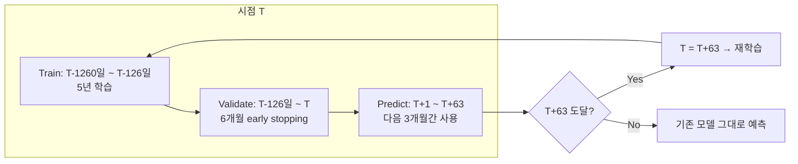
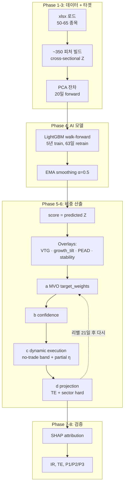

# cc2_harness — AI 로직 및 종목별 비중 산출 방법론

> 이 문서는 cc2_harness 펀드가 어떤 AI 모델을 사용해서 무엇을 예측하고, 그 예측이 어떻게 종목별 타겟 비중으로 변환되는지를 설명한다.
> 운영 흐름(`update_and_deploy.bat`이 무엇을 호출하는지)은 [UPDATE_AND_DEPLOY_FLOW.md](UPDATE_AND_DEPLOY_FLOW.md)에 정리되어 있다.
>
> 작성일: 2026-05-15 · 기준 manifest: `variants/iter15_65tkr_reb21_vtg.yaml` · 기준 config: `src/config.py` `DEFAULT_CONFIG`

---

## 1. 핵심 아이디어 한 줄 요약

> **350여 개의 전통적 피처를 LightGBM으로 비선형 결합해서 "20일 후 종목별 잔차 수익률"을 예측 → cvxpy MVO로 위험·턴오버·제약을 동시 최적화 → 21일마다 종목별 타겟 비중을 산출.**

핵심 분담:
| 무엇이 | 어떻게 |
|---|---|
| 신호 (어떤 종목이 좋은가) | LightGBM 예측 |
| 포트폴리오 (얼마나 사야 하는가) | cvxpy MVO + 제약 |
| 운영 안전장치 | walk-forward, EMA 스무딩, post-prediction overlay, dynamic execution, hard projection |

---

## 2. 예측 타겟: 20일 forward Specific Return

ML 모델이 예측하려는 **y**는 종목의 전체 수익률이 아니다. 시장·섹터 공통 요인을 제거한 **잔차 수익률**.

### 정의 (`src/target_engine.py` `build_targets`)
```
시점 t에서:
  1. 과거 252영업일 일간 수익률로 PCA 적합 (look-ahead 방지)
  2. 다음 20영업일 누적수익률 r_{t→t+20}을 계산
  3. PCA의 상위 5개 component (n_components=5) 중 처음 2개 (pca_n_remove=2)를 제거
  4. 남은 잔차 = Specific Return = 그 종목 고유의 알파
  5. 잔차를 cross-sectional Z-score로 정규화 → y
```

### 왜 잔차인가?
- 전체 수익률을 예측하면 모델이 "지금이 강세장이다" 같은 시장 베타 신호를 학습. 시장 베타는 어차피 벤치마크가 가져감.
- 잔차만 예측하면 모델이 *상대적으로 누가 더 좋을지*에 집중 → 알파 예측에 특화.
- PCA 5개 중 2개만 제거하는 이유: 너무 많이 빼면 잔차가 0에 가까워져 신호도 사라짐. 50종목 universe에서 2개가 sweet spot (실증).

### 핵심 파라미터 (src/config.py)
- `pca_components`: 5
- `pca_n_remove`: 2
- `pca_lookback`: 252영업일 (1년)
- `forward_horizon`: 20영업일

---

## 3. 입력 피처: ~350개를 7개 그룹으로

### 피처 모드 (`feature_mode`)
production은 `core` 모드 = 약 61개 피처 (feature_importance 기반 prune 후 핵심만). `lean`은 ~80개, `full`은 ~350개. 모두 `src/feature_engine.py` `build_all_features`가 빌드.

### 7개 피처 그룹 (`scripts/build_dashboard_data.py:31-63` `GROUPS_DICT`)

| 그룹 | 대표 피처 | 무엇을 잡으려 하나 |
|---|---|---|
| **Growth** | `best_eps_chg_252d`, `best_sales_accel`, `oper_margin_chg_252d` | 컨센서스 EPS / 매출 / 마진 성장 가속 |
| **Quality** | `best_roe_level_z`, `cash_conversion_z`, `op_leverage_63d` | 자본 수익성, 현금 흐름 변환, 영업 레버리지 |
| **Value** | `best_peg_ratio_level_z`, `best_ev_to_best_ebitda_level_z`, `fin_pe_chg_63d` | PEG / EV/EBITDA / PER 변화 |
| **Revision** | `eps_rev`, `eps_rev_ma_63d`, `tg_upside`, `analyst_rec_level` | 애널리스트 EPS 리비전 모멘텀, 목표주가 upside |
| **Momentum** | `momentum_252d`, `risk_adj_mom_252d`, `ma_cross_50_200`, `mom_accel_63_252` | 가격 모멘텀, MA cross, 가속 |
| **Low-vol** | `realized_vol_21d`, `idio_vol_63d`, `beta_63d` | 변동성 / idio 변동성 / 베타 |
| **Macro** | `regime_mkt_ret_21d`, `mc_vix_x_mom252`, `fac_yield_slope` | 시장 레짐, VIX × 모멘텀 cross 등 macro-cross |

### 모든 피처는 cross-sectional Z-score로 정규화
같은 시점의 모든 종목을 비교 가능하게 표준화. 절대값이 아닌 **상대 순위**가 신호의 본질.

### 피처 → 신호 → 알파의 경제적 직관 (예시)
- "EPS 리비전이 강한 종목 + 모멘텀이 높은 종목 + 밸류에이션 부담이 적은 종목"이라면 종합 점수가 높음 → MVO가 OW
- 단, 단일 그룹만 보면 노이즈. 350개 피처를 LightGBM이 *비선형 결합* (피처 간 interaction까지 포착)해서 합성 신호를 만든다.

### EWMA 피처 importance
재학습 사이에 갑자기 importance가 튀는 노이즈 방지. EWMA로 스무딩(α=0.3)하고, 누적 importance 하위 5%는 자동 제거 (단, 최소 60개 피처는 유지).
- `ewma_enabled: True`, `ewma_alpha: 0.3`, `ewma_drop_pct: 0.05`, `ewma_min_features: 60`

---

## 4. 모델: LightGBM walk-forward

### 왜 LightGBM (vs Linear / NN)?
| 후보 | 단점 | 결론 |
|---|---|---|
| Linear regression | 350개 피처 비선형 interaction (예: "VIX 높을 때만 momentum 효과") 못 잡음 | X |
| Random Forest | LightGBM 대비 학습 느림, 비슷한 성능 | X |
| Neural network | 50~65 종목 × 1260일 = ~70K 샘플로는 underfit, 해석 불가 | X |
| **LightGBM** | gradient boosting trees가 작은 dataset에서도 잘 동작, SHAP으로 해석 가능 | **선택** |

### 핵심 하이퍼파라미터 (`src/config.py:140-155`)
```python
lgbm_params = {
    "learning_rate": 0.05,
    "num_leaves": 31,
    "max_depth": 6,
    "min_child_samples": 60,        # V2 강화 — 노이즈 split 방지
    "subsample": 0.8,
    "colsample_bytree": 0.8,
    "reg_alpha": 0.1,
    "reg_lambda": 1.0,
    "n_estimators": 500,
}
early_stopping_rounds = 100
```

### Walk-forward 구조 (`src/model_trainer.py` `walk_forward_train`)


| 파라미터 | 값 | 의미 |
|---|---|---|
| `train_window` | 1260 (5년) | 학습 데이터 길이 |
| `val_window` | 126 (6개월) | early stopping 검증 |
| `retrain_freq` | 63 (3개월) | 재학습 주기 |
| `forward_horizon` | 20 | y의 forward window |
| `embargo_days` | 20 (= `forward_horizon`) | train/val/predict 사이의 라벨-누수 차단 갭 |

### Walk-forward가 왜 필수인가? — Look-ahead bias 방지
- 만약 전체 12년 데이터로 한 번에 학습하면 "2026년 데이터로 2018년을 예측" — fantasy.
- 매 재학습 시점마다 **그 시점 이전 데이터만** 사용. 2018년 예측은 2018년 이전 데이터로만 학습한 모델이 만든다.

### 성과 평가 정책 (selection-bias-discipline Task C step 3, 2026-05-19)

1. **Primary**: IR, rolling IR 분포 (252d window: mean / min / pos_frac),
   SPA p-value (Hansen 2005 simplified, block_size=10, n_iter=1000, seed=42).
   - Source: `src/analytics.rolling_ir_stats`, `spa_pvalue`.
   - 자동으로 `compute_metrics()`가 산출 → `metrics.json` 노출.
   - Promotion gate: `docs/BASELINE.md` § "Gate criteria"의 1~5번 조건.
2. **Diagnostic only**: P1/P2/P3 sub-period IRs (`src/harness.SUB_PERIODS`),
   max drawdown, IC stability. Regime-by-regime 해석 용도. promotion gate 아님.
3. **Anti-pattern**: 단일 sub-period IR을 promotion gate로 쓰는 것. 다중 비교
   비용 증가 (3개 상관된 목표 ≈ N_trials × 3) → selection bias 확산.

### 라벨 누수 방지: walk-forward embargo (data-leakage-fix, 2026-05-19)
타겟이 *20일 forward 수익률*이므로 train_end 직전 샘플의 라벨 윈도우(=20일)는
val 구간으로, val_end 직전 샘플의 라벨 윈도우는 실제 예측 구간으로 자연스럽게
침범한다. 갭 없이 학습/검증/예측을 직접 잇대면 early stopping이 미래 데이터를
보고 best iter를 고르는 결과 → **라벨 누수**.

`_compute_window_bounds`가 다음 레이아웃을 강제한다:

```
train:   [t-train_window,        t-val_window-embargo)
embargo: [t-val_window-embargo,  t-val_window)            ← 버림
val:     [t-val_window,          t-embargo)
embargo: [t-embargo,             t)                       ← 버림
predict: t
```

`embargo=forward_horizon=20`이면 train 마지막 라벨 종료시점이 정확히 val_start와,
val 마지막 라벨 종료시점이 정확히 predict 인덱스와 맞닿게 된다 — peek 0.

embargo로 윈도우가 너무 좁아지면 (`embargo + val_window > train_window`)
해당 retrain은 스킵하고 직전 모델을 재사용한다.

이 패치 도입 시 baseline IR이 1.31 → 0.39 수준으로 떨어지는데, 이는 모델이
*나빠진* 것이 아니라 누수가 사라진 결과. 자세한 측정치는 `docs/BASELINE.md`의
"Canonical Baseline (Research)" 섹션 참조. 참고문헌: López de Prado (2018),
*Advances in Financial Machine Learning*, Ch. 7 ("Cross-Validation in Finance").

### EMA prediction smoothing
재학습 직후 모델이 갑자기 다른 답을 내면 turnover 폭증. 이를 방지하려고 새 모델 예측과 직전 예측을 EMA로 블렌딩:
```
final_pred = α · new_model_pred + (1-α) · prev_pred,  α = 0.5
```

---

## 5. 예측값 → 종목 점수 → MVO 입력

### Phase 4 출력
모델이 매일 모든 종목 i에 대해 예측 `pred_i_t` 생성 → cross-sectional Z-score로 변환:
```
score_i_t = (pred_i_t - mean_t(pred)) / std_t(pred)
```
`score_i_t`가 곧 "그 종목이 평균 대비 얼마나 좋은가"의 정량 지표. 이게 MVO의 expected returns 입력.

### Post-prediction overlay (production)
raw score는 그대로 MVO에 들어가지 않음. 4가지 overlay가 score를 *보정*한다 (`src/backtest.py:1325-1339`, manifest로 ON/OFF):

#### 5.1 Value Trap Gate (VTG) — production manifest의 핵심
yaml override에서 활성:
```yaml
value_trap_gate_enabled: true
vtg_pe_z_threshold: -0.5      # PE z-score < -0.5 (싸 보임)
vtg_momentum_threshold: -0.5  # 252d momentum < -0.5 (가격 약세)
vtg_accel_threshold: 0.5      # oper_margin_accel > 0.5 (마진 가속)
vtg_scale: 0.0                # 위 3조건 만족 시 score = 0 으로 차단
```
**경제적 의미**: "PE는 싸 보이는데 가격이 떨어지고 있고, 마진은 일시적으로 좋아 보이는" 종목 — 흔히 *value trap* 패턴. 실증적으로 향후 20일 -0.25% (적중률 47.3%) → MVO가 OW하지 못하게 score를 0으로 zeroing.

#### 5.2 Growth tilt
EPS 리비전과 펀더멘털 성장 모멘텀에 추가 가중:
```yaml
growth_tilt_enabled: true
growth_tilt_weight: 0.25         # z-score 단위로 +0.25 boost
growth_tilt_rev_weight: 0.50     # revision 50%
growth_tilt_fundamental_weight: 0.50  # 펀더멘털 50%
```
이미 LightGBM이 학습한 패턴을 한 번 더 강조. Growth-Quality balance 회복용.

#### 5.3 PEAD boost (Post-Earnings Announcement Drift)
실적 발표 직후 며칠은 시장이 sluggish하게 반응 → score를 일시적으로 boost:
```yaml
pead_boost_enabled: true
pead_boost_weight: 0.30      # 최대 +0.30 z-score
pead_decay_days: 7           # 7일 exponential decay
pead_max_days: 21            # 21일까지만
```

#### 5.4 Signal stability shrinkage
재학습 직전/직후 score 변화가 큰 경우 → 그 종목의 신뢰도가 낮다고 보고 score를 0 쪽으로 shrink. 일종의 자기-안정화.

### 최종 score → MVO expected_returns
overlay 적용 후 최종 `score_i_t`가 `optimize_portfolio()`의 `expected_returns` 인자로 입력.

---

## 6. 비중 산출: 4단계 production parity

여기가 핵심. score가 어떻게 종목 비중이 되는지.

리밸런싱 일자(매 21영업일)마다 다음 4단계를 거친다 (`src/backtest.py:1077-1162` 또는 daily mode `daily_update.py:440-506`):

### (a) Target weights — cvxpy MVO

`src/portfolio_optimizer.py` `optimize_portfolio`:

```
Maximize:  E[r] · w  −  λ · (w − w_bm)ᵀ Σ (w − w_bm)  −  τ · ||w − w_prev||₁

Subject to:
  Σ w_i = 1                                   (full investment)
  0 ≤ w_i ≤ max_weight                        (long-only, 종목 상한 15%)
  |w_sector − w_bm_sector| ≤ sector_deviation (섹터 ±10%)
  TE_annual ≤ max_te_annual                   (벤치마크 추적오차 4.5%)
  active_share L1 ≤ max_active_share          (active 50%)
  |w_i − w_bm_i| ≤ max_active_per_stock       (종목별 active 12%)
```

| 파라미터 (production) | 값 | 의미 |
|---|---|---|
| `risk_aversion` (λ) | 1.0 | active risk 페널티 |
| `turnover_penalty` (τ) | 0.03 | 1bps turnover당 0.03% 벌점 |
| `max_te_annual` | 0.045 | 연간 4.5% TE 한도 |
| `max_weight` | 0.15 | 종목당 최대 15% |
| `sector_deviation` | 0.10 | 섹터별 ±10% |
| `max_active_per_stock` | 0.12 | 종목당 BM 대비 ±12% |
| `cov_lookback` | 126영업일 | Σ 추정 lookback |

**공분산 Σ**: 126영업일 일간 수익률에 Ledoit-Wolf shrinkage 적용 + mega-cap 변동성 조정. 단순 sample covariance는 50종목 × 126일에서 불안정.

**벤치마크 w_bm**: cap-weighted (CUR_MKT_CAP 시트 기준). EW가 아님 — 이게 REDESIGN A의 핵심 전환.

### (b) Confidence — 신호의 신뢰도

`compute_signal_confidence(pred_row, raw_pred_row, trailing_ic_mean)` (`src/backtest.py:792`):
```
confidence = function(spread_in_predictions, trailing_IC)
  - spread: 오늘 예측의 cross-sectional 표준편차 → 분산 클수록 신뢰도↑
  - trailing IC: 최근 6회 리밸런싱의 IC 평균 → 최근 모델이 잘 맞췄으면 신뢰도↑
```
`confidence ∈ [0, 1]`. 낮으면 "오늘은 신호가 약하니 trade 줄이자"의 signal.

### (c) Dynamic execution — 노이즈 trade 차단 + 부분 실행

`apply_dynamic_execution(prev_w, target_w, confidence, config)` (`src/backtest.py:1077-1162`):

#### no-trade band
```
if |target_w_i − prev_w_i| < no_trade_band:
    candidate_w_i = prev_w_i   # trade 0
```
- `no_trade_band: 0.003` (30bps) → 3 bps 미만 변화는 무시. 실거래 비용 대비 의미 없는 미세 조정 방지.

#### Partial rebalance
신뢰도가 낮으면 target의 50%만 적용:
```
candidate_w = prev_w + η · confidence · (target_w − prev_w)
```
- `partial_rebalance_eta: 0.5` (기본 50%)

### (d) Projection — hard 제약 강제

`project_portfolio_weights(...)` (`src/portfolio_optimizer.py`):
candidate_w가 (a)단계의 모든 제약을 여전히 만족하는지 재검증. dynamic execution이 살짝 vary시켰으니 max_te_annual / sector_deviation을 다시 강제:

```python
if get_score_based:
    new_w = project_capped_weights(...)         # score 기반 단순 cap
else:
    new_w = project_portfolio_weights(...)      # TE + sector hard projection
```
production은 후자.

### Score-gated OW
모델 score가 0 미만(평균 이하)인 종목은 BM weight 이상으로 OW 금지:
```yaml
enforce_score_gated_ow: true
score_threshold_for_ow: 0.0
```
**경제적 의미**: "negative score인데 OW하는" MVO의 quirk(diversification 효과로 안 좋은 종목도 약간 추가) 차단.

### Core-Satellite 구조
production manifest는 portfolio를 두 layer로 분해:
```yaml
portfolio_style: core_satellite
satellite_budget: 0.225           # one-way active share = 22.5%
satellite_max_per_stock: 0.04     # 한 종목당 satellite 분 ±4%
```
- **Core (~78%)**: 벤치마크 추적
- **Satellite (~22%)**: AI 신호로 active 운용
직관: "BM에서 너무 멀리 가지 않으면서, 강한 신호가 있는 ~22%만 적극적으로 베팅."

### Mega-cap protection
시총 4% 이상인 mega cap (예: AAPL, MSFT, NVDA)에 대해서는 OW/UW 모두 추가 제약:
```yaml
mega_cap_protection_enabled: true
mega_cap_bm_threshold: 0.04       # bm_weight ≥ 4%만 대상
mega_cap_funding_mode: true        # 이 종목들로부터만 fund 조달
mega_cap_funding_k: 4              # top 4개 mega cap만 funding source
```
mega cap은 한 번 잘못 OW/UW하면 전체 포트 IR을 흔들어버리므로 보수적 처리.

---

## 7. Walk-forward와 데이터 누수 방지

### 어떤 누수를 막아야 하나
1. **타겟 누수**: t시점 예측에 t+1 이후 데이터 사용 X
2. **PCA 누수**: PCA fit에 forward 데이터 사용 X (`src/target_engine.py`가 매 t마다 과거 252일로만 fit)
3. **모델 누수**: 모델 학습에 그 시점 이후 데이터 사용 X
4. **공분산 누수**: Σ 추정에 forward 데이터 사용 X
5. **OOS holdout**: tuning 시 train_cutoff_date 강제 (`enforce_oos_holdout: True`)

### Production execution timing (look-ahead 제거 핵심)
`daily_update.py:351-357`의 주석에 명시된 4-step:
```
Step 1: 오늘의 PnL을 "어제 끝나면서 가지고 있던 비중"으로 계산
Step 2: 오늘 수익률로 비중 drift
Step 3: 종가에 리밸런싱 → 새 비중은 다음날부터 효과
Step 4: TC를 오늘 PnL에서 차감
```
이 순서가 깨지면 "오늘 결정한 비중으로 오늘 수익을 챙기는" look-ahead가 발생.

---

## 8. 검증: 무엇으로 신호가 좋은지 판단하나

### 백테스트 핵심 지표 (`src/backtest.py` `compute_metrics`)
| 지표 | 의미 | 합격선 (production) |
|---|---|---|
| **IR** (Information Ratio) | (Return − BM Return) / TE | ≥ 1.0 long-only |
| **Active Return** | 연환산 active 수익률 | > 0 |
| **TE** (Tracking Error) | 연환산 추적오차 | ≤ 4.5% (`max_te_annual`) |
| **Turnover** | 연환산 단방향 turnover | 150~200% |
| **Sub-period IR** | P1/P2/P3 sub-period 각각의 IR | 모두 양수 (regime 견고성) |
| **Max Drawdown** | 누적 최대 손실 | 작을수록 좋음 |

### Selection Bias 검증 (`run_selection_bias.py`)
실험 횟수 N에 따른 Deflated Sharpe Ratio (Bailey & Lopez de Prado 2014):
```
DSR = SR · √((N − 1) · (1 − SR² · skew + ...) / N)
```
N이 클수록 우연히 좋은 SR이 나올 확률 보정. `experiment_inventory.json`에 모든 historical 시도 누적 (현재 N≈400+).

---

## 9. 한눈에 보는 흐름



---

## 10. Production manifest와 핵심 override

`variants/iter15_65tkr_reb21_vtg.yaml` 전문:

```yaml
label: iter15_65tkr_reb21_vtg
description: >
  iter15_65tkr_reb21 + post-prediction value-trap gate. Zeroes score for
  (cheap PE z<-0.5) & (momentum_252d<-0.5) & (oper_margin_accel>+0.5)
  profile — empirically -0.25% / 20d specific return (hit 47.3%), -1.99%
  in P3 regime. Does not touch panel/model, so split destabilization
  risk seen in iter15_65tkr_reb21_sent is avoided.
  Target: P3 IR improvement ≥ +0.2, P1/P2 preserved, turnover ≤ +5%p.
out_dir: outputs/iter15_65tkr_reb21_vtg
tuning_mode: production
overrides:
  rebalance_freq: 21
  value_trap_gate_enabled: true
  vtg_pe_z_threshold: -0.5
  vtg_momentum_threshold: -0.5
  vtg_accel_threshold: 0.5
  vtg_scale: 0.0
```

**해석**: 이 manifest가 실제로 바꾸는 것은:
1. 리밸런싱 주기를 default 21일로 (PipelineConfig 기본도 21이지만 명시)
2. Value Trap Gate를 ON + 임계값 설정
나머지는 `DEFAULT_CONFIG`의 production 값 (cap-weighted BM, core-satellite, score-gated OW, mega-cap protection, PEAD boost, growth tilt 등 전부 default ON).

---

## 11. FAQ

### Q. 모델이 종목별로 따로 학습되나?
A. NO. *하나의* LightGBM이 모든 종목 × 모든 시점의 (피처, 타겟) 쌍을 통째로 학습. 출력만 cross-sectional Z-score로 변환되어 종목 간 비교 가능해짐. 이게 "panel regression" 접근.

### Q. 매일 매번 학습하나?
A. NO. 학습은 63영업일에 한 번. 그 사이엔 같은 모델로 예측만. EMA로 재학습 직후 충격 완화.

### Q. 종목별로 사이즈가 다른데 (NVDA 5조 vs LITE 100억) 비교가 의미있나?
A. PCA로 시장 베타 제거 + cross-sectional Z-score로 정규화 → 잔차의 상대 순위만 봄. 시총 자체는 conditioning 피처로 들어가서 모델이 "size effect"는 별개로 학습.

### Q. AI가 잘못된 신호를 줄 때는?
A. 5단계 안전장치:
1. **Walk-forward**: 학습 데이터에 미래 없음
2. **EMA smoothing**: 갑작스런 예측 변화 완화
3. **VTG / overlays**: 실증적으로 나쁜 패턴 차단
4. **Score-gated OW**: 음수 점수 종목은 OW 금지
5. **Hard projection**: TE / sector / size 제약 강제

### Q. 매일 update_and_deploy.bat을 돌리면 매일 비중이 바뀌나?
A. NO. 리밸런싱 일자(매 21영업일)에만 실제 비중 변경. 비-리밸 일자는 가격 drift만 반영. `--mode incremental`은 daily, `--mode full`은 전체 backtest 재계산.

### Q. 어떤 종목이 OW되었는지 어떻게 보나?
A. Streamlit Cloud 대시보드 (`streamlit_mobile.py` → cc2-dashboard repo) — score breakdowns 섹션에서 리밸런싱일별 종목 × group z-score 매트릭스 + 최종 비중 vs BM 비교.

---

## 12. 참고문헌 / 추가 읽기

- **PCA 잔차 기반 specific return**: Pictet 2014 internal note (코드 design 의도 — `CLAUDE.md` Phase 3 참조)
- **Selection bias / Deflated Sharpe**: Bailey & Lopez de Prado (2014) "The Deflated Sharpe Ratio"
- **LightGBM 하이퍼파라미터 가이드**: `CLAUDE.md` Phase 4 + 본 문서 §4
- **Core-Satellite 포트폴리오 구조**: `CLAUDE.md` 핵심 파라미터 표 + REDESIGN F 노트
- **Production 운영 흐름**: [UPDATE_AND_DEPLOY_FLOW.md](UPDATE_AND_DEPLOY_FLOW.md)
- **피처 카탈로그**: [FEATURE_CATALOG.md](FEATURE_CATALOG.md)
- **현재 baseline 메트릭**: [BASELINE.md](BASELINE.md)
- **개선 로드맵**: [ROADMAP.md](ROADMAP.md)
