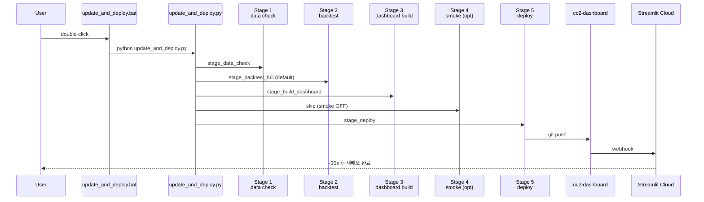
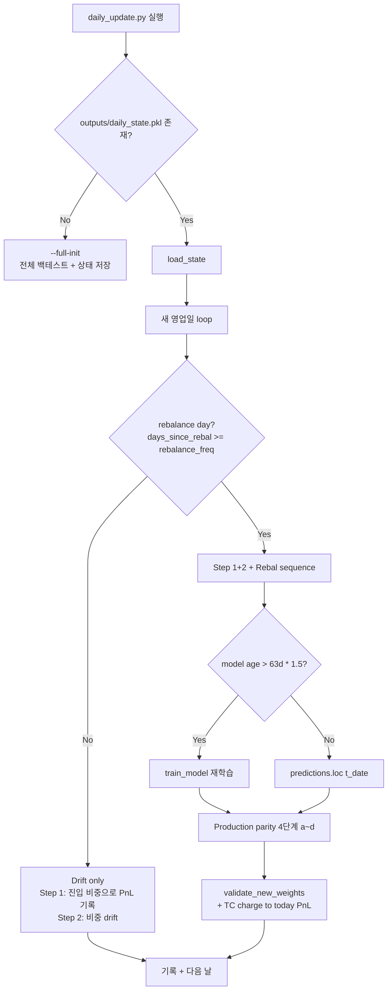

# `update_and_deploy.bat` — 최종 파이프라인 흐름

> 이 문서는 cleanup 후 production 운영자가 읽어야 할 단 하나의 운영 reference다.
> 작성일: 2026-05-15 · 대상 production manifest: `variants/baseline_v5_deploy.yaml`

## Cutover history

| 날짜 | 변경 | 사유 |
|---|---|---|
| 2026-04-24 | (production locked) `variants/iter15_65tkr_reb21_vtg.yaml` | IR 1.31, VTG ON. `outputs/baseline_v4/` alias 도입. |
| **2026-05-19 v2** | **`variants/baseline_v5_deploy.yaml`** | data-leakage-fix 이후 honest evaluation. embargo + cutoff + lean panel 조합으로 baseline_v5 (5/5 primary gates PASS, Adjusted SR 0.524) 가 promotion-eligible 판정. 기존 leaky variant 의 `outputs/baseline_v4/` 는 `outputs/baseline_v4_legacy/` 로 백업. dashboard hard-code 경로 `outputs/baseline_v4/` 는 alias로 유지. 자세한 promotion 절차: `phases/final-v1-promotion/`. |

Roll-back: `update_and_deploy.py:DEFAULT_VARIANT`을 `iter15_65tkr_reb21_vtg.yaml`로 되돌리고 `cp -r outputs/baseline_v4_legacy/* outputs/baseline_v4/` 복원.

## Live drift monitor (final-v1-promotion step 4, 2026-05-19 v2)

매 `daily_update.py` / `update_and_deploy.py --mode full` 실행 마지막에 다음이 자동 수행된다:

1. `outputs/live_log/<date>.csv` 에 그 날의 target weights 가 한 번 저장
   (intra-day 재실행 시 덮어쓰지 않음 — `_persist_live_snapshot` 의 idempotency).
2. `scripts/compute_live_delta.py` 가 `outputs/live_delta_log.csv` 를 append 갱신.
3. `l1_drift > 0.10` 일 경우 stdout 에 `[LIVE-DELTA WARN]` 출력.

`l1_drift` 가 큰 날은 (a) 코드 변경 (b) 데이터 정합성 문제 (c) walk-forward 재훈련 boundary 의 의도된 reshuffle 중 하나. **0.10 초과가 2영업일 연속 발생하면 root-cause 조사**: 코드 diff, data freshness, retrain date 와 일치 여부 점검.

Monitor 는 advisory only — 실패해도 deploy 는 중단되지 않는다.

---

## 1. 개요

### 한 줄 요약

새 가격 데이터(`data/ai_signal_data.xlsx`) → walk-forward backtest 풀 리런 → dashboard 페이로드 빌드 → cc2-dashboard repo로 git push → Streamlit Cloud 자동 재배포까지 한 번의 더블클릭으로.

### 사용 시나리오 vs 실행 모드

| 모드 | 시나리오 | 소요 시간 | 갱신 대상 |
|---|---|---|---|
| `--mode full` (default) | 매주~격주 정식 갱신 | ~3~4분 | `outputs/baseline_v4/backtest_result.pkl` 전체 재계산 + dashboard pkl + cc2-dashboard repo |
| `--mode incremental` | 매일 가격 추가 (가벼움) | ~10초~1분 | `outputs/daily_state.pkl` + `outputs/csv/*.csv` 만. **dashboard pkl은 갱신 X** |

### 요구사항
- Python 3.10+, `requirements.txt` 설치된 venv
- 데이터 파일: `data/ai_signal_data.xlsx` (실 경로는 `update_and_deploy.py:57` `DEFAULT_DATA_FILE`)
- cc2-dashboard repo 로컬 clone (기본 `C:/Users/westl/Documents/cc2-dashboard`, env `CC2_DASHBOARD_REPO`로 override)

---

## 2. Entry: `update_and_deploy.bat`

전체 33줄 wrapper. 핵심 동작:

| 라인 | 동작 |
|---|---|
| `cd /d "%~dp0"` | bat 위치 디렉토리로 이동 (어디서 더블클릭하든 동일 cwd 보장) |
| `if exist "..\..\..\..\Scripts\activate.bat" call activate.bat` | 4단계 위 venv 자동 활성 |
| `python update_and_deploy.py %*` | bat에 전달된 모든 인자 forward (예: `--mode incremental`, `--no-push`) |
| `if %ERR% NEQ 0 ... pause` | 비-0 종료 시 메시지 + pause (콘솔 닫기 전 에러 확인) |

---

## 3. Orchestrator: `update_and_deploy.py`

### 5-stage sequence



### CLI 옵션 (`python update_and_deploy.py --help`)

| 옵션 | 기본값 | 설명 |
|---|---|---|
| `--mode {incremental,full}` | `full` | Stage 2 분기 |
| `--data <path>` | `DEFAULT_DATA_FILE` | xlsx 데이터 파일 |
| `--variant <yaml>` | `variants/iter15_65tkr_reb21_vtg.yaml` | full 모드용 manifest |
| `--run-dir <path>` | `outputs/baseline_v4` | canonical backtest 결과 디렉토리 (promote 대상) |
| `--dashboard-repo <path>` | `C:/Users/westl/Documents/cc2-dashboard` | 배포 대상 repo |
| `--no-push` | (off) | 로컬 commit만, push 생략 |
| `--no-build` | (off) | Stage 3 skip |
| `--no-deploy` | (off) | Stage 5 skip |
| `--smoke` | (off) | Stage 4 활성 (blocking streamlit 서버) |

---

## 4. Stage 1 — Data sanity check

함수: `update_and_deploy.py:153-185` `stage_data_check(data_file)`

| Step | 동작 |
|---|---|
| 1 | 파일 존재 확인. 없으면 `fatal()` (exit 1) |
| 2 | 파일 크기 + mtime 출력 |
| 3 | `_peek_last_data_date()` — `pd.read_excel(usecols=[0])`로 Daily_Returns 시트 마지막 날짜만 가벼운 read |
| 4 | age 분기: `<=1d` "fresh" / `<=7d` "OK" / `>7d` **WARN** (fail 아님) |

운영자가 xlsx 갱신을 잊었을 때를 잡기 위해 도입됨 (이전엔 file mtime만 체크해서 stale data로 backtest를 그대로 push하는 사고가 있었다).

---

## 5. Stage 2a — Full mode (`run_variant.py`)

함수: `update_and_deploy.py:238-263` `stage_backtest_full(variant, run_dir)`
호출 명령: `python run_variant.py --variant variants/iter15_65tkr_reb21_vtg.yaml`

### 흐름

```mermaid
flowchart TB
    A[run_variant.py --variant ...vtg.yaml] --> B[load_manifest<br/>yaml 파싱 + override 검증]
    B --> C[compose_config<br/>tuning_mode 적용]
    C --> D{SAFE_FOR_CACHE_REUSE 검사}
    D -- 안전 OR --no-cache --> E[Phase 1/2/4 cache reuse<br/>+ run_backtest 호출]
    D -- 위험 --> F[전체 파이프라인 재실행]
    E --> G[outputs/iter15_65tkr_reb21_vtg/<br/>{metrics.json, backtest_result.pkl, manifest}]
    F --> G
    G --> H[_promote_variant_artifacts<br/>→ outputs/baseline_v4/]
```

### 주요 로직

- **Manifest 로드** (`run_variant.py:81-108`): yaml 파싱 + `tuning_mode` 검증 + DEFAULT_CONFIG에 없는 unknown override key 거부
- **Checkpoint 안전성 검사** (`run_variant.py:206-247`): `SAFE_FOR_CACHE_REUSE` set에 포함된 override만 캐시와 호환. Phase 1/2/4 (data/feature/training) 자체를 바꾸는 override가 있으면 자동 cache disable
- **`run_backtest` 호출** (`run_variant.py:269-284`): 8-phase 메인 파이프라인 (§7)
- **Promote** (`update_and_deploy.py:217-235`): `outputs/<variant>/`의 pkl/metrics/manifest를 `outputs/baseline_v4/`로 `shutil.copy2`. variant 디렉토리는 audit trail로 보존

---

## 6. Stage 2b — Incremental mode (`daily_update.py`)

함수: `update_and_deploy.py:191-214` `stage_backtest_incremental(data_file)`

### DailyState 스키마 (pickle)

`daily_update.py:64-92` `@dataclass DailyState` (schema_version=2):
- `weights`, `tickers` — 현재 비중
- `days_since_rebal`, `rebalance_freq` — 리밸런싱 카운터
- `port_rets`, `bm_rets`, `spx_rets`, `turnovers` — 누적 시계열
- `rebal_weights`, `daily_weights`, `bm_rebal_weights` — 비중 이력
- `models`, `predictions` — 학습 캐시
- `ic_values`, `sector_map`

### 분기



### Production parity 4단계 (`daily_update.py:440-506`)

리밸런싱 일자에 backtest와 정확히 같은 결과가 나오도록 보장:

| 단계 | 코드 | 함수 |
|---|---|---|
| (a) target_weights | `daily_update.py:457-464` | `optimize_portfolio()` — MVO with cov shrinkage |
| (b) confidence | `daily_update.py:467-479` | `compute_signal_confidence()` — spread × trailing IC |
| (c) candidate_weights | `daily_update.py:482-484` | `apply_dynamic_execution()` — no-trade band + partial η, conf-scaled |
| (d) new_weights | `daily_update.py:487-506` | `project_portfolio_weights()` — TE + sector hard constraints |

### 중요 한계

`daily_update.py`는 `outputs/daily_state.pkl` + `outputs/csv/*.csv`만 갱신하고 `outputs/baseline_v4/backtest_result.pkl`을 갱신하지 않는다. 따라서 **`--mode incremental`만 운영하면 dashboard는 마지막 `--mode full` 시점의 결과를 계속 표시한다** (`update_and_deploy.py:194-198` 주석).

---

## 7. `src.backtest.run_backtest`의 8 phase

`run_variant.py`와 `daily_update.py --full-init` 둘 다 결국 `src.backtest.run_backtest`로 위임. 본 §은 8 phase를 **운영 관점**에서 한 줄씩 요약. AI 모델 / 비중 산출의 *상세 메커니즘* (어떤 잔차를 예측하나, post-prediction overlay가 어떻게 score를 보정하나, MVO 4단계가 어떻게 전개되나)은 [**AI_METHODOLOGY.md**](AI_METHODOLOGY.md) 참조.

| Phase | 모듈 | 역할 |
|---|---|---|
| **Phase 1** | `src/data_loader.py` `UniverseData` | xlsx 로드, ticker 매핑 (Apple→AAPL 등), 결측치 처리 (ffill → cross-sectional median) |
| **Phase 2** | `src/feature_engine.py` `build_all_features` | ~350 피처 (Accounting, Price, Sentiment, Conditioning, Macro). Cross-sectional Z-score 정규화 |
| **Phase 3** | `src/target_engine.py` `build_targets` | 20일 forward Specific Return = PCA(n=5) 잔차 |
| **Phase 4** | `src/model_trainer.py` `walk_forward_train` | 3년 rolling LightGBM, 63일마다 재학습, EMA prediction smoothing (α=0.5) |
| **Phase 5** | `src/backtest.py` 메인 루프 | Walk-forward 백테스트, 21일(yaml override) 리밸런싱 |
| **Phase 6** | `src/portfolio_optimizer.py` `optimize_portfolio` | cvxpy MVO. risk_aversion, turnover_penalty, max_TE, sector ±10% |
| **Phase 7** | `src/attribution.py` `run_attribution` | SHAP TreeExplainer, feature group 기여도 |
| **Phase 8** | `src/backtest.py` `compute_metrics` | IR, TE, turnover, sub-period (P1/P2/P3) IRs |

산출물: `BacktestResult` 객체 → pickle → `outputs/<variant>/backtest_result.pkl` (~65MB; panel 49MB + models 4MB + ...)

---

## 8. Stage 3 — Dashboard payload 빌드

함수: `update_and_deploy.py:269-291` `stage_build_dashboard(run_dir, data, out_pkl)`
호출 명령: `python scripts/build_dashboard_data.py --run --data --out`

### 입출력

- **입력**: `outputs/baseline_v4/backtest_result.pkl` (~65MB) + `data/ai_signal_data.xlsx` (CUR_MKT_CAP 시트만 추가 read)
- **출력**: `outputs/baseline_v4/dashboard_data.pkl` (~3MB)

### 6 산출 항목 (`scripts/build_dashboard_data.py:73-216`)

| 항목 | 설명 |
|---|---|
| `feature_importance_pct` | LightGBM gain importance를 walk-forward 평균 → % |
| `ic_table` | feature × Spearman IC mean/std/IR + bucket 매핑 |
| `group_pnl` | 7개 feature group (Growth/Quality/Value/Revision/Momentum/Low-vol/Macro) long-short PnL |
| `score_breakdowns` | 리밸런싱일별 종목 × group z-score 매트릭스 |
| `rebal_predictions` | 리밸런싱일별 raw prediction |
| `bm_weights` / `portfolio_weights` | 비중 이력 |

---

## 9. Stage 4 — Local smoke (optional)

함수: `update_and_deploy.py:297-306` `stage_smoke()`
- `--smoke` 옵션 시에만
- `subprocess.run([python, -m, streamlit, run, streamlit_mobile.py])` blocking
- 사용자가 결과 확인 → Ctrl+C → `--no-smoke`로 deploy 진행

기본 OFF.

---

## 10. Stage 5 — cc2-dashboard repo 배포

함수: `update_and_deploy.py:327-373` `stage_deploy(dashboard_repo, run_dir, dashboard_pkl, push)`

### SYNC_FILES (`update_and_deploy.py:71-75`)
- `streamlit_mobile.py`
- `requirements_dashboard.txt`

### 추가 sync
- `outputs/baseline_v4/dashboard_data.pkl` (relative path 보존)

### Git 흐름
1. `_git(["status", "--porcelain"])` — 변경 없으면 commit/push 건너뜀
2. `_git(["add", *SYNC_FILES])`
3. `_git(["add", "-f", str(rel.as_posix())])` — pkl은 .gitignore에 있으므로 -f
4. `_git(["commit", "-m", f"update: dashboard data {timestamp}"])`
5. `_git(["push", "origin", "main"])` (`--no-push` 옵션 시 생략)

### Streamlit Cloud 자동 재배포
push 감지 → ~30초 안에 재빌드 + 재배포 → 휴대폰에서 `https://<user>-cc2-dashboard.streamlit.app` 접속 시 최신 데이터.

상세 setup: [DEPLOY.md](../DEPLOY.md) 참조.

---

## 11. 산출물 매핑 표 (전체 stage 통합)

| Stage | Input 파일 | 호출 스크립트 | Output 파일 |
|---|---|---|---|
| 1 | `data/ai_signal_data.xlsx` (Daily_Returns 시트만 peek) | (없음 — pd.read_excel) | (console만) |
| 2a (full) | 위 + `variants/iter15_65tkr_reb21_vtg.yaml` | `run_variant.py` → `src.backtest.run_backtest` | `outputs/iter15_65tkr_reb21_vtg/{metrics.json, backtest_result.pkl, experiment_manifest.json}` → promote → `outputs/baseline_v4/` |
| 2b (incr) | 위 + `outputs/daily_state.pkl` | `daily_update.py` | `outputs/daily_state.pkl` 갱신 + `outputs/csv/*.csv` |
| 3 | `outputs/baseline_v4/backtest_result.pkl` + xlsx의 CUR_MKT_CAP | `scripts/build_dashboard_data.py` | `outputs/baseline_v4/dashboard_data.pkl` |
| 4 | `outputs/baseline_v4/dashboard_data.pkl` | `streamlit run streamlit_mobile.py` | (none — blocking server) |
| 5 | 위 + `streamlit_mobile.py` + `requirements_dashboard.txt` | `git add/commit/push` | cc2-dashboard repo의 같은 경로 |

---

## 12. 매일 운영 워크플로우

### A. 매일 (가벼운 갱신, dashboard 미반영)

```
1. data/ai_signal_data.xlsx 새 영업일 데이터 추가
2. update_and_deploy.bat --mode incremental    (~30초~1분)
3. 콘솔 출력 확인 (오늘 PnL, 누적, 현재 비중 Top 5)
```

주의: dashboard pkl은 갱신되지 않으므로 휴대폰 대시보드는 마지막 full 시점을 계속 표시.

### B. 매주~격주 (정식 갱신, dashboard 자동 재배포)

```
1. data/ai_signal_data.xlsx 최신 데이터 확인
2. update_and_deploy.bat                       (인자 없이 = --mode full)
3. ~3-4분 대기 (백테스트 진행 콘솔 모니터)
4. "[OK] Pipeline finished. Streamlit Cloud will redeploy in ~30s." 메시지 확인
5. 휴대폰에서 https://<user>-cc2-dashboard.streamlit.app 접속 → 새 데이터 확인
```

### C. 응급 (push 보류하고 로컬에서만 확인)

```
update_and_deploy.bat --no-push --smoke
# 로컬 streamlit 띄움 → 결과 확인 → Ctrl+C
# OK면 다시 update_and_deploy.bat (push 포함)
```

---

## 13. 트러블슈팅

| 증상 | 원인 | 복구 |
|---|---|---|
| Stage 1 "data file not found" | xlsx 경로 오류 | `--data <abs_path>` 명시 또는 `update_and_deploy.py:57` `DEFAULT_DATA_FILE` 수정 |
| Stage 1 "data is Nd old" WARN | xlsx에 새 영업일 미반영 | xlsx refresh 후 재실행. 7일 이내면 진행 가능 (warn은 fail이 아님) |
| Stage 2 full "variant yaml not found" | yaml 경로 오류 | `--variant <abs_path>` 명시 |
| Stage 2 full backtest 중 OOM | 데이터/피처 메모리 부족 | venv에 충분한 RAM 확보, 다른 프로세스 종료 |
| Stage 2 incr "daily_state.pkl 없음" | 첫 실행 | 자동으로 `--full-init` 실행됨 |
| Stage 2 incr "schema v1 < v2" | 옛 state pkl | `outputs/daily_state.pkl` 삭제 후 `--mode incremental` 재실행 |
| Stage 2 incr 비중 검증 실패 | 제약 위반 | 콘솔 메시지 확인. 자동으로 이전 비중 유지 + state_backup.pkl로 롤백 시도 |
| Stage 3 "backtest_result.pkl not found" | full 모드 한 번도 안 돌림 | `update_and_deploy.bat` (full mode 한 번) 실행 |
| Stage 5 "dashboard repo not found" | repo path 오류 | `CC2_DASHBOARD_REPO` env var 또는 `--dashboard-repo` 옵션 |
| Stage 5 git push 실패 | 인증 / 충돌 | 수동으로 `cd <dashboard_repo> && git pull --rebase && git push` |
| Streamlit Cloud "Module Not Found" | requirements 누락 | `requirements_dashboard.txt`에 추가 → 재배포 |
| 휴대폰에서 dashboard에 옛 날짜 표시 | --mode incremental만 돌림 | `--mode full` 실행으로 dashboard pkl 갱신 |

---

## 부록 A: 주요 환경 변수

| 환경 변수 | 기본값 | 용도 |
|---|---|---|
| `CC2_DASHBOARD_REPO` | `C:/Users/westl/Documents/cc2-dashboard` | Stage 5 배포 대상 |
| `CC2_RUN_DIR` | `outputs/baseline_v4` | canonical run dir |

## 부록 B: variants/iter15_65tkr_reb21_vtg.yaml 핵심 override

(`variants/iter15_65tkr_reb21_vtg.yaml`의 production manifest. 자세한 내용은 yaml 직접 참조)

핵심 파라미터:
- `rebalance_freq`: 21 (21영업일 = 약 1개월)
- `value_trap_gate_enabled`: true (PE z-score 높고 momentum 약한 종목 차단)
- 65 ticker universe
