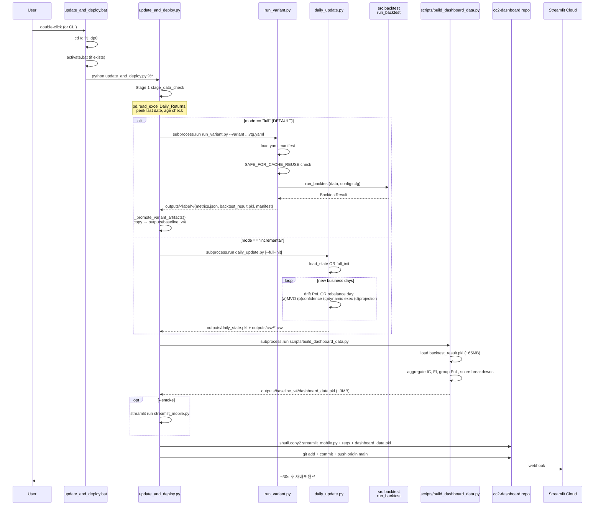

# `update_and_deploy.bat` 흐름 추적

## 한 줄 요약

새 가격 데이터(xlsx) → `run_variant.py`로 walk-forward backtest 풀-리런 → dashboard 페이로드 압축 → cc2-dashboard repo로 git push → Streamlit Cloud 자동 재배포까지 한 번의 더블클릭.

## Sequence Diagram

## Stage 1 — Data sanity check

함수: `update_and_deploy.py:153-185` `stage_data_check(data_file)`

| Step | 동작 |
|---|---|
| 1 | 파일 존재 확인. 없으면 `fatal()` (exit 1) |
| 2 | 파일 크기 + mtime 출력 |
| 3 | `_peek_last_data_date()` — pd.read_excel(usecols=[0])로 Daily_Returns 시트 마지막 날짜만 가벼운 read |
| 4 | age 분기: <=1d "fresh" / <=7d "OK" / >7d **WARN** (fail X) |

## Stage 2 — Backtest

`update_and_deploy.py:386` 기본값 `--mode full` (Fix B(2)). 분기:

### Stage 2a: full mode (`run_variant.py`)
함수: `update_and_deploy.py:238-263` `stage_backtest_full(variant, run_dir)`
- `subprocess.run([python, run_variant.py, --variant, ...vtg.yaml])`
- run_variant.py 흐름:
  1. `load_manifest()` (`run_variant.py:81-108`) — yaml 파싱 + override key 검증
  2. `compose_config()` (`run_variant.py:111-127`) — tuning_mode 적용
  3. `SAFE_FOR_CACHE_REUSE` 검사 (`run_variant.py:206-247`) — Phase 1/2/4 cache reuse 가능 판단
  4. `run_backtest(data, config=cfg)` 호출 (`run_variant.py:269-284`) → 8-phase 메인 파이프라인
  5. metrics.json, backtest_result.pkl, experiment_manifest.json 작성 (`run_variant.py:293-320`)
- `_promote_variant_artifacts()` (`update_and_deploy.py:217-235`) — `outputs/<label>/` → `outputs/baseline_v4/`

### Stage 2b: incremental mode (`daily_update.py`)
함수: `update_and_deploy.py:191-214` `stage_backtest_incremental(data_file)`
- state pkl 없으면 `--full-init` 자동 부트스트랩
- 있으면 normal incremental:
  - `daily_update.py:310-557` `incremental_update(data)`
  - 새 영업일 loop:
    - drift-only: `daily_update.py:362-374` (Step 1: PnL 진입 비중, Step 2: 비중 drift)
    - rebal day (`days_since_rebal >= rebalance_freq`):
      - 모델 재학습 트리거: `days_since_train > 63 * 1.5` (`daily_update.py:382-384`)
      - Production parity 4단계:
        - (a) `optimize_portfolio()` (`daily_update.py:457-464`)
        - (b) `compute_signal_confidence()` (`daily_update.py:467-479`)
        - (c) `apply_dynamic_execution()` (`daily_update.py:482-484`)
        - (d) `project_portfolio_weights()` (`daily_update.py:495-506`)
      - `validate_new_weights()` 실패 시 이전 비중 유지
- `outputs/daily_state.pkl` 갱신 + `outputs/csv/*.csv` export

**중요한 한계:** incremental mode는 `outputs/baseline_v4/backtest_result.pkl`을 갱신하지 않음 → dashboard_data.pkl도 옛 데이터로 표시됨 (`update_and_deploy.py:194-198` 주석).

## Stage 3 — Build dashboard payload

함수: `update_and_deploy.py:269-291` `stage_build_dashboard(run_dir, data, out_pkl)`
- `subprocess.run([python, scripts/build_dashboard_data.py, --run, --data, --out])`
- 입력: `outputs/baseline_v4/backtest_result.pkl` (~65MB) + xlsx의 CUR_MKT_CAP 시트
- 출력: `outputs/baseline_v4/dashboard_data.pkl` (~3MB)
- 6 산출 항목: feature_importance_pct, ic_table, group_pnl, score_breakdowns, rebal_predictions, bm/portfolio weights

## Stage 4 — Local smoke (optional)

함수: `update_and_deploy.py:297-306` `stage_smoke()`
- `--smoke` 옵션 시에만
- `subprocess.run([python, -m, streamlit, run, streamlit_mobile.py])` blocking
- 사용자가 결과 확인 → Ctrl+C → `--no-smoke`로 deploy 진행

## Stage 5 — Deploy to cc2-dashboard

함수: `update_and_deploy.py:327-373` `stage_deploy(dashboard_repo, run_dir, dashboard_pkl, push)`

| Step | 동작 |
|---|---|
| 1 | dashboard_repo 존재 + .git 검사 |
| 2 | `shutil.copy2` SYNC_FILES (streamlit_mobile.py, requirements_dashboard.txt) → dashboard_repo |
| 3 | `shutil.copy2` dashboard_data.pkl (relative path 보존) → dashboard_repo |
| 4 | `git status --porcelain` — 변경 없으면 skip |
| 5 | `git add SYNC_FILES` |
| 6 | `git add -f outputs/baseline_v4/dashboard_data.pkl` (.gitignore 우회) |
| 7 | `git commit -m "update: dashboard data {timestamp}"` |
| 8 | `--no-push`이 아니면 `git push origin main` → Streamlit Cloud 자동 재배포 (~30s) |

## subprocess.run 호출 카탈로그

| 호출 위치 | 명령 | 목적 |
|---|---|---|
| `update_and_deploy.py:122` `run()` helper | `subprocess.run(cmd, cwd=cwd, check=False)` | Stage 2/3에서 외부 Python 스크립트 실행 (run_variant.py, daily_update.py, build_dashboard_data.py) |
| `update_and_deploy.py:301` | `subprocess.run([python, -m, streamlit, run, streamlit_mobile.py])` | Stage 4 smoke (blocking) |
| `update_and_deploy.py:316,321` `_git()` helper | `subprocess.run(['git', *args], cwd=cwd)` | Stage 5의 모든 git 명령 (status, add, commit, push) |

## Input/Output 매핑 표

| Stage | Input 파일 | 호출 스크립트 | Output 파일 |
|---|---|---|---|
| 1 | `data/ai_signal_data.xlsx` (Daily_Returns 시트만 peek) | (없음 — pd.read_excel) | (없음 — console만) |
| 2a (full) | 위 + `variants/iter15_65tkr_reb21_vtg.yaml` | `run_variant.py` → `src.backtest.run_backtest` | `outputs/iter15_65tkr_reb21_vtg/{metrics.json, backtest_result.pkl, experiment_manifest.json}` → promote → `outputs/baseline_v4/` |
| 2b (incr) | 위 + `outputs/daily_state.pkl` | `daily_update.py` | `outputs/daily_state.pkl` (갱신) + `outputs/csv/*.csv` |
| 3 | `outputs/baseline_v4/backtest_result.pkl` + xlsx의 CUR_MKT_CAP | `scripts/build_dashboard_data.py` | `outputs/baseline_v4/dashboard_data.pkl` |
| 4 | `outputs/baseline_v4/dashboard_data.pkl` | `streamlit run streamlit_mobile.py` | (none — blocking server) |
| 5 | 위 + `streamlit_mobile.py` + `requirements_dashboard.txt` | `git add/commit/push` | cc2-dashboard repo의 같은 경로 |
